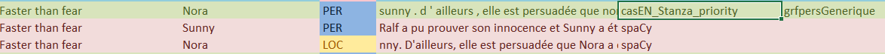

# 🧠 Named Entity Recognition (NER)

This project focuses on optimizing a natural language processing (NLP) pipeline to detect and classify named entities in **French texts**, across the following categories:

* `PER` – Person
* `LOC` – Location
* `ORG` – Organization
* `MISC` – Miscellaneous

We leverage **multiple NER tools** to maximize accuracy:

* **CasEN**: A linguistic rule-based system based on **Unitex**, developed by linguists.
* **spaCy**: A fast and efficient NLP library.
* **Stanza**: A deep learning-based NLP library from Stanford, well-suited for morphologically rich languages.

---

## 🔄 Multi-Model Entity Detection & Cross-Validation

Each text description is first processed individually by all three systems (**CasEN**, **spaCy**, and **Stanza**).
Then, we apply a **cross-validation strategy** during result fusion:

### 🧹 Cross-System Agreement

* If multiple systems detect the **same entity**, we merge their outputs and label them accordingly.
* Example: If both **CasEN** and **Stanza** detect "Nora" as a `PER`, the merged method becomes `CasEN_Stanza`.

### ⚖️ Conflict Resolution with Priority Rules

When an entity is detected by **multiple systems with different labels**, we apply **priority rules**:

* Entities found by **more systems** are considered more reliable.
* If systems agree on the **entity** but not on the **label**, we prioritize the **most frequent or reliable label** among agreeing systems.

#### 🧠 Example



As shown above:

* Both **CasEN** and **Stanza** classify **“Nora”** as a **Person (`PER`)**.
* **spaCy**, however, classifies it as a **Location (`LOC`)**.

📌 As a result, the merged label becomes:

```txt
CasEN_Stanza_priority
```

This indicates that CasEN and Stanza agreed on both the entity and the label, and their interpretation takes precedence over spaCy’s.

---

## 📅 Installation

### 1. Clone the repository

```bash
git clone https://github.com/Valentin-Gauthier/NER.git
cd NER
```

### 2. Install dependencies

```bash
pip install -r requirements.txt
```

---

## ✍️ Author

Valentin — Bachelor’s degree, 3rd year, Computer Science
Internship at LIFAT - 2025
